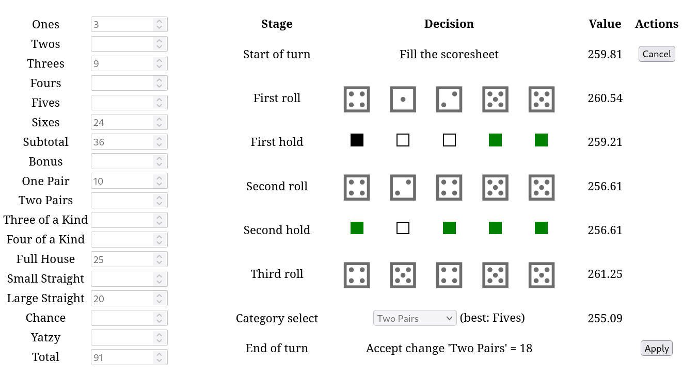

# Yatzy Solver
## Overview
Yatzy is a popular dice game in the Nordic countries, similar to Yahct and Yahtzee. Rules for the game can be found in the [Wikipedia article](https://en.wikipedia.org/wiki/Yatzy).

This project calculates the expected values for every possible state in solitaire Yatzy and determines the mathematically-guaranteed optimal strategy. Using this strategy, the overall expected score is 248.44 points.

The program provides a simple web frontend, allowing users to explore the strategy and view the expected values interactively.



## Usage
Project can be compiled on Linux with
```
> g++ -O3 main.cpp -o yatzysolver 
```

and started with
```
> ./yatzysolver
```

The states are already precalculated in states.bin file. If the file is not found, the program starts generating it automatically. That took about 4 hours on my modern 6-core processor, but the time may vary significantly based on system.

After states have been loaded, a web frontend can be accessed at [http://localhost:8080](http://localhost:8080).

## Implementation details
Let’s consider the possible states of the game at the start of a turn. For the upper section fields, there are 7 possible values (including empty and zero). Similarly, there are 8 values for "one pair," 9 for "two pairs," and so on. This results in approximately 2^43 possible states.

However, when calculating the expected score, the key factors are the categories still open and, if the bonus hasn't been achieved, the current upper section score. In any given situation, we can simply sum the current total score and the expected future score. This reduces the number of relevant states to 2^15*64=2^21.

Each turn has six stages: first roll, firt hold, second roll, second hold, second roll and category select. Rolls are random, so their expected scores are calculated by summing the weighted averages of all possible outcomes (252 combos) based on their probabilities, while considering holds from the previous roll. For holds and category selection, all possible choices are evaluated, and the optimal choice is selected.

States are stored only at the start of each turn. From these starting points, the intermediate stages of the turn can be computed quickly.

Technically, we use dynamic programming and multithreading to calculate the states from the ones with the least categories open (final states) to those with more open categories. Dynamic programming is similarly used within invidual states.

## Limitations
This project determines the optimal strategy to achieve the **highest average score** in **solitaire** Yatzy. The strategy can't be applied to winning games with more than one player. Different approaches would be also required to pursue other objectives, such as maximizing the number of games with scores exceeding 300 or minimizing those falling below 200. A good improvement could be including deviations of choices, making it possible to implement also strategies like those.